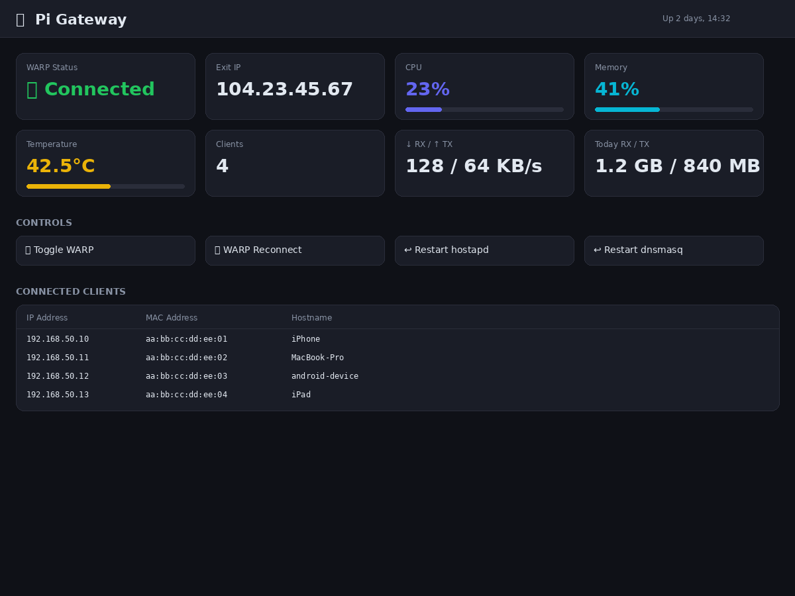

# EdgeGateway — Cloudflare WARP Edge Gateway

**Version:** v1.0  
**Status:** Active Development  
**Repository:** https://github.com/OneByJorah/EdgeGateway

---

## Table of Contents

- [Overview](#overview)
- [Architecture](#architecture)
- [Technology Stack](#technology-stack)
- [Features](#features)
- [Getting Started](#getting-started)
- [Service Management](#service-management)
- [Project Structure](#project-structure)
- [Screenshots](#screenshots)
- [Contributing](#contributing)
- [License](#license)
- [Author](#author)

---

## Overview

EdgeGateway deploys Cloudflare WARP on edge devices (Raspberry Pi and Linux hosts) to provide secure tunneling, DNS privacy, and outbound proxy functionality. The repository includes a lightweight dashboard for monitoring WARP state and a two-step installer/bootstrap flow.

---

## Architecture

Host (Linux/arm64) → Cloudflare WARP client (`warp-svc`) → Internet. Dashboard template (`templates/dashboard.html`) provides local visibility into connection state.

Setup stages:
1. `01_install.sh` — installs the WARP client and dependencies.
2. `02_configure.sh` — registers the client and configures routing/mode.

---

## Technology Stack

| Layer | Stack |
|---|---|
| Runtime | Linux (Ubuntu 22.04+, Raspberry Pi OS) |
| Provisioning | Bash / Cloudflare WARP |
| Frontend | HTML5 Dashboard (`templates/dashboard.html`) |
| VCS | Git + GitHub (`github.com/OneByJorah/EdgeGateway`) |

---

## Features

- **One-click WARP setup**: install and register scripts included.
- **Edge-friendly**: targets Raspberry Pi and low-power ARM hosts.
- **Local dashboard**: lightweight HTML status view.
- **Reusable templates**: `templates/dashboard.html` ready for extension.

---

## Getting Started

```bash
# 1. Clone the repository
git clone https://github.com/OneByJorah/EdgeGateway.git
cd EdgeGateway

# 2. Install WARP + dependencies (run as root)
sudo ./01_install.sh

# 3. Configure and register
sudo ./02_configure.sh
```

> These scripts are intended for clean Debian/Ubuntu-based Linux systems.
> Review scripts before running on production devices.

---

## Service Management

WARP runs as a system-managed service after registration. Check status:

```bash
sudo warp-cli status
```

Dashboard access depends on how the template is served (simple static hosting or integrated into a local web service).

---

## Project Structure

```
EdgeGateway/
├── 01_install.sh
├── 02_configure.sh
├── README.md
├── screenshot-dashboard.png
└── templates/
    └── dashboard.html
```

---

## Screenshots

### EdgeGateway Dashboard


---

## Contributing

1. Create a feature branch off `main`.
2. Keep provisioning scripts POSIX-sh compatible where possible.
3. Submit a PR with description and screenshots for dashboard changes.

---

## License

MIT

---

## Author

Built by **Jhonattan L. Jimenez**.
